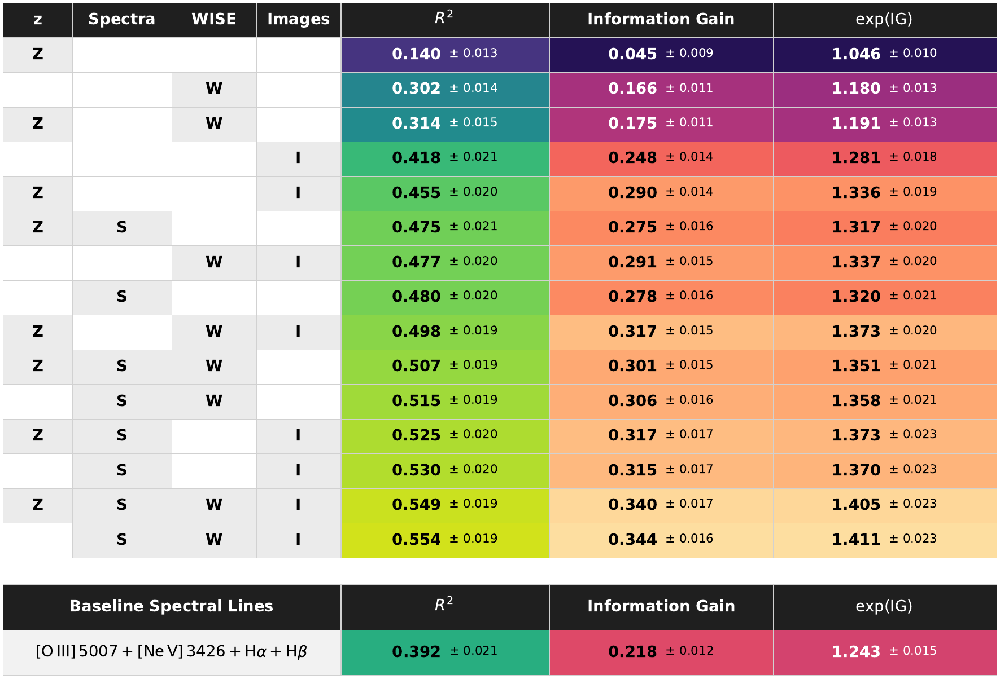
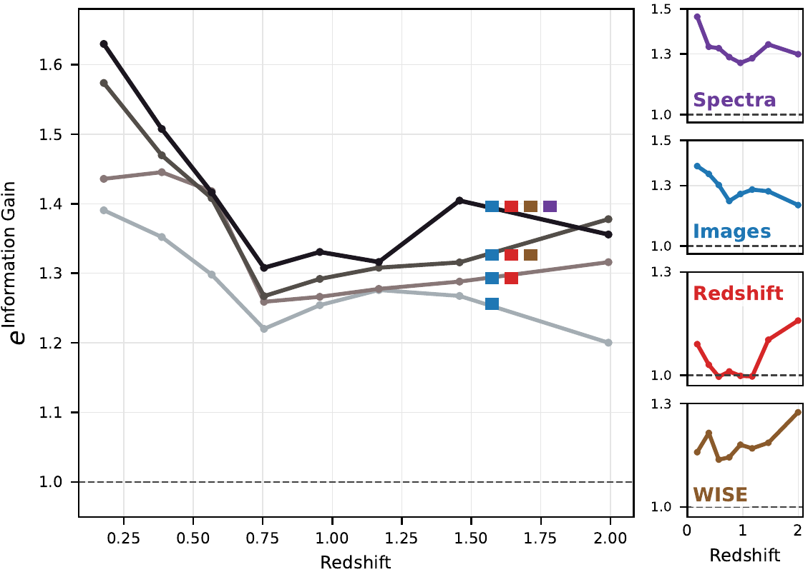
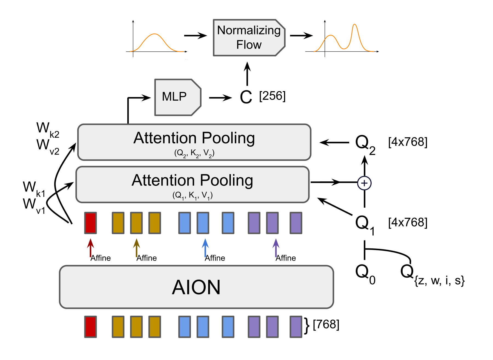

# Exploring the Connection Between Optical and X-ray Emission in Active Galactic Nuclei

A probabilistic normalizing-flow head on frozen [AION](https://github.com/PolymathicAI/AION)
multimodal embeddings that predicts **eROSITA broad-band X-ray flux** from DESI spectra, Legacy
Survey imaging, WISE mid-infrared photometry, and redshift, and quantifies how much X-ray
information each optical and infrared modality carries.

[](https://github.com/RoccoDiTella/erosita-desi-aion-flow/actions/workflows/test.yml)
[](LICENSE)
[](pyproject.toml)
[](https://openreview.net/forum?id=u401Qxwqgw)
[](https://github.com/PolymathicAI/AION)

**Paper.** "Exploring the connection between optical and X-ray emissions in Active Galactic Nuclei,"
by Rebeka L. Bottger\*, Rocco Di Tella\*, Carolina Cuesta-Lazaro, Jason Reeves, Nico Cappelluti, and
Rafael Martínez-Galarza (\*equal contribution). Conference on Physics and AI (PAI 2026), Stanford
University.

---

## Overview

Supermassive black hole accretion is most directly visible in X-rays, while host galaxies are richly
observed in optical and infrared surveys. Quantifying how much X-ray information is shared with these
non-X-ray modalities constrains how accretion, gas, dust, and galaxy structure are observationally
connected.

We attach a probabilistic normalizing-flow head to frozen AION multimodal embeddings and predict
eROSITA broad-band X-ray flux from DESI spectra, Legacy Survey imaging, WISE mid-infrared
photometry, and redshift. Rather than a point estimate, the model outputs a **full conditional
density** `p(log F_X | inputs)`, which lets us report calibrated likelihood-based metrics:

- **Information gain (IG):** mean log-likelihood improvement over an unconditional KDE prior (in
  nats). `exp(IG)` is the equivalent likelihood-gain factor.
- **R²** and **RMSE** on the posterior-mean prediction.

Evaluating every one of the 15 non-empty modality combinations isolates which observations carry
X-ray information. The full multimodal model reaches R² = 0.549 and exp(IG) = 1.405, outperforming a
classical optical emission-line baseline (R² = 0.392).

## Results

Full results (all 15 modality combinations with 1σ bootstrap intervals, plus the emission-line
baseline) are in [`results/`](results/). A few rows (target `log_ml_flux_1`, test set n = 3,054):

| Inputs | R² | Info gain (nats) | exp(IG) | RMSE |
|---|:---:|:---:|:---:|:---:|
| Spectra + WISE + Images | 0.554 | 0.344 | 1.411 | 0.218 |
| All four (Spectra + z + WISE + Images) | 0.549 | 0.340 | 1.405 | 0.219 |
| Spectra only | 0.480 | 0.278 | 1.320 | 0.235 |
| Emission-line baseline ([O III] + [Ne V] + Hα + Hβ) | 0.392 | 0.218 | 1.243 | 0.254 |

The top two configurations are tied within 1σ (their bootstrap intervals overlap; see
`results/results_table.png`): spectra+WISE+images edges out the rest on R², and adding redshift once
spectra are present buys nothing measurable. We report **all four inputs** as the headline, the full
multimodal model, rather than the marginal R² winner. Either way the flow comfortably beats the
classical emission-line baseline (R² 0.392).

<p align="center">
  
</p>

Information gain is not a fixed number; it varies with redshift. Spectra and imaging dominate at low
redshift, while WISE and redshift become more informative at high redshift:

<p align="center">
  
</p>

## Architecture

<p align="center">
  
</p>

The frozen AION-base encoder turns each modality into a sequence of 768-dimensional tokens. A learned
modality-affine calibration rescales and shifts those tokens per modality, and four learned global
queries (offset by a 16-way modality-presence embedding) pool them through two attention blocks of
eight heads each (cross-attention, self-attention, and a feed-forward layer). The pooled
4 × 768 = 3072 features pass through an MLP (3072, 512, 512, 256) to form the context of a
conditional [Zuko](https://github.com/probabilists/zuko) neural spline flow over
`p(log X-ray flux | inputs)`.

The AION backbone stays frozen; only the attention-pooling head and the flow are trained. Each
modality combination is built from native AION input objects (`DESISpectrum`, `Z`,
`LegacySurveyFluxW1/2/3`, `LegacySurveyImage`), so dropping a modality means omitting it from the
input list rather than zero-masking it. The presence embedding lets the pooling adapt to whichever
inputs are actually present.

## Repository layout

```text
erosita-desi-aion-flow/
├── shareable_aion_flow/
│   ├── attention_pooling_head.py   # q4/l2 attention-pooling head (ModalityAffine, queries, blocks)
│   ├── normalizing_flow.py         # conditional Zuko NSF + KDE prior + target standardizer
│   ├── data_to_aion_embeddings.py  # data staging, AION tokenizer, dataloaders
│   ├── evals.py                    # posterior metrics + readable results table
│   ├── main.py                     # CLI: prepare-data / train / eval / make-table
│   ├── tests/                      # lightweight unit tests
│   └── data/manifests/             # train/val/test split + target coordinates
├── docs/DATA.md                    # how to obtain the (public) data
├── results/                        # paper results table + figures + metrics CSVs
├── assets/                         # README figures
├── .github/workflows/test.yml      # CI: run the test suite on push / PR
├── pyproject.toml
├── CITATION.cff
└── LICENSE
```

## Installation

Requires Python ≥ 3.10.

```bash
python -m pip install -e .            # core (numpy, torch, h5py, astropy, ...)
python -m pip install -e ".[flow]"    # + zuko            (the normalizing flow)
python -m pip install -e ".[aion]"    # + polymathic-aion (the frozen encoder)
python -m pip install -e ".[dev]"     # + pytest
```

Full training and evaluation need both `zuko` and `polymathic-aion`. The unit tests run with only the
core install.

## Data

The model trains on ~24.6k sources in the DESI × eROSITA overlap (split 24,614 / 3,094 / 3,054 for
train / validation / test), each with a DESI spectrum, WISE photometry, and a Legacy Survey image
cutout. The raw catalogs and the ~11 GB FITS cutout pool are **not** shipped here; they are built
from public data releases. See [`docs/DATA.md`](docs/DATA.md) for the exact sources (DESI DR1,
SRG/eROSITA DR1, Legacy Survey DR10), the expected `data/raw/` layout, and how `prepare-data` stages
them. The frozen split manifest is included so the partition is reproducible.

## Usage

```bash
# 1. Stage image-backed train/val/test HDF5 files (needs the raw inputs; see docs/DATA.md)
python -m shareable_aion_flow.main prepare-data --overwrite

# 2. Train the attention-flow model (AION frozen)
python -m shareable_aion_flow.main train \
    --staged-dir shareable_aion_flow/data/staged \
    --target log_ml_flux_1 --epochs 50 --batch-size 448 --eval-after-train

# 3. Evaluate all 15 modality combinations from a checkpoint
python -m shareable_aion_flow.main eval \
    --checkpoint shareable_aion_flow/outputs/<run-id>/best.pt \
    --staged-dir shareable_aion_flow/data/staged \
    --output-dir shareable_aion_flow/outputs/<run-id>
```

A fast staging smoke test (no AION or zuko required) runs on a handful of sources:

```bash
python -m shareable_aion_flow.main prepare-data --output-dir /tmp/smoke --limit 12 --overwrite
```

## Reproducing the paper

This repository is a **clean reference implementation** of the paper's q4/l2 attention-flow model.
The architecture matches the paper exactly: frozen AION-base, four learned queries, two
attention-pooling blocks with eight heads, and a one-dimensional neural spline flow (8 transforms,
256-d context). The training recipe here is intentionally **simplified** (a uniform
modality-combination sampler in place of the paper's tuned mixture), so it reaches the neighborhood
of the paper's Table 1 (all-inputs R² ≈ 0.55, exp(IG) ≈ 1.40) rather than reproducing it
bit-for-bit.

Paper model settings: target `log_ml_flux_1`, seed 42, ~50 epochs, batch size 448, KDE prior;
train/val/test sizes 24,614 / 3,094 / 3,054 sources.

## Citation

If you use this code, please cite the paper:

```bibtex
@inproceedings{bottger2026optical,
  title     = {Exploring the connection between optical and X-ray emissions in Active Galactic Nuclei},
  author    = {Bottger, Rebeka L. and Di Tella, Rocco and Cuesta-Lazaro, Carolina and
               Reeves, Jason and Cappelluti, Nico and Mart\'{i}nez-Galarza, Rafael},
  booktitle = {Conference on Physics and AI (PAI)},
  year      = {2026},
  note      = {Equal contribution: Bottger and Di Tella},
  url       = {https://openreview.net/forum?id=u401Qxwqgw}
}
```

## Acknowledgments

Built on the [AION](https://github.com/PolymathicAI/AION) multimodal foundation model (Polymathic AI)
and public data from [DESI DR1](https://data.desi.lbl.gov), [SRG/eROSITA
DR1](https://erosita.mpe.mpg.de/dr1/), and the [DESI Legacy Imaging Surveys
DR10](https://www.legacysurvey.org). Developed with [AstroAI](https://astroai.cfa.harvard.edu) at the
Center for Astrophysics | Harvard & Smithsonian.

## License and responsibility

Released under the [MIT License](LICENSE), © 2026 Rocco Di Tella. The code in this repository was
written and is maintained by Rocco Di Tella, who is solely responsible for any errors in it. The
remaining authors above are authors of the paper.
