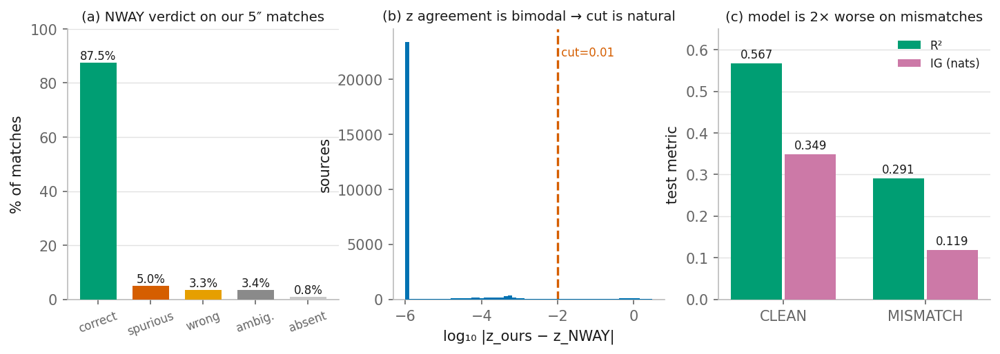
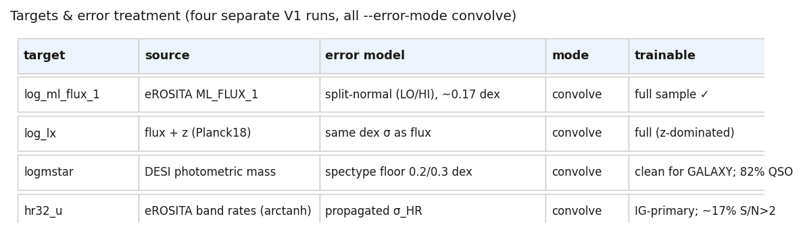
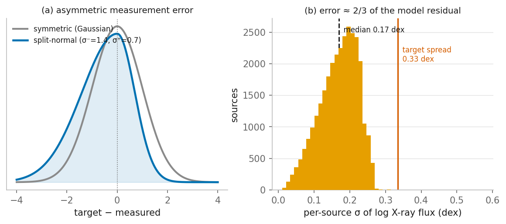
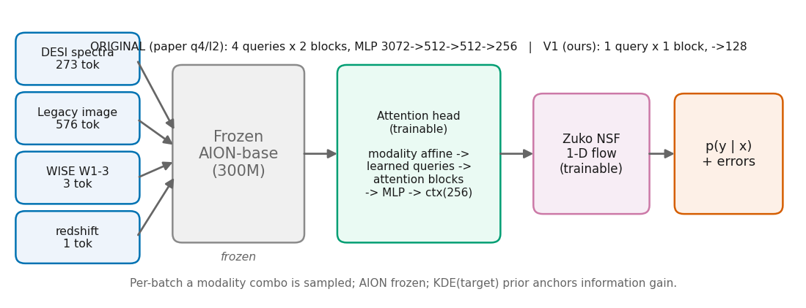
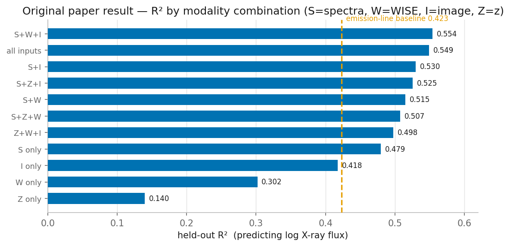

# eROSITA × DESI × AION-flow — Experiment Pipeline

**Living document — keep in sync with the actual pipeline. Last updated: 2026-07-17.**
Render to PDF with `python docs/render_pipeline_pdf.py` (writes `docs/pipeline.pdf`).

## 1. Goal
Use a frozen astronomical foundation model (AION-1 base) as an information probe: predict eROSITA X-ray properties (broad-band flux, luminosity, hardness) and host stellar mass from non-X-ray DESI modalities (optical spectra, WISE, redshift, Legacy imaging) with a probabilistic normalizing-flow head. Report likelihood gain over a prior, not just point R². This repo extends the PAI26 paper with (a) a cleaned crossmatch and (b) uncertainty-aware, per-target training.

## 2. Compute
- **FASRC** (Harvard SLURM). Account **`finkbeiner_lab`** (confirmed working 2026-07-21); smokes on `gpu_test`, real runs on `gpu`. `siag_gpu` is *not* visible to us yet — it needs `siag_lab` group membership (Coldfront request pending).
- Env: `module load Miniforge3/26.1.0-fasrc01` + conda env + **cu124 torch wheel** + `pip install -e . polymathic-aion zuko safetensors wandb`. Built at `$AIONFLOW_ROOT/envs/aionflow` (torch 2.6.0+cu124).
- **Workflow:** develop locally → git push → `git pull` on the cluster; the SSH ControlMaster socket `~/.ssh/cm-fasrc` is used only to submit jobs and move data. All real work runs in `sbatch` jobs on compute nodes (login-node compute gets killed by arbiter2).
- **Tracking: Weights & Biases** (`--wandb`, project `erosita-desi-aion-flow`). Logs config, per-step batch NLL, per-epoch train/val NLL, and the final per-combination test metrics table. Auto-falls back to `offline` if a compute node lacks outbound internet (`wandb sync` later); a tracking failure never kills a job.

## 3. Data sources & download
| Modality | Source | Notes |
|---|---|---|
| X-ray catalog | SRG/eROSITA-DE **DR1 / eRASS1** (Merloni+2024) | broad band `ML_FLUX_1` + sub-bands P1–P4 rates/fluxes **with asymmetric errors** (LOWERR/UPERR). Delivered as the eROSITA×DESI match CSVs. |
| Optical spectra | **DESI DR1** coadd spectra | per-healpix `coadd-{survey}-{program}-{healpix}.fits`, trimmed to matched targetids, compiled to `erosita_spectra_merged_32k.hdf5`. |
| Imaging | **Legacy Survey DR10** griz cutouts | 160×160 px `fits_pool/<targetid>.fits` via legacysurvey.org cutout service (~11 GB). |
| Redshift / galaxy props | DESI DR1 VAC | z, `logmstar` (photometric), emission lines, `spectype` (QSO/GALAXY/STAR). |
| Foundation model | `polymathic-ai/aion-base` (HuggingFace, ~95 MB) | frozen tokenizer + backbone. |

All inputs are local; only `aion-base` is internet-bound. "Adding sources our match missed" would require new DESI DR1 spectrum downloads (deferred).

## 4. Crossmatch & cleaning
- **Original match (existing):** naive **5″ nearest-neighbor** (`crossmatch_radec.py`, astropy) between DESI target RA/Dec and the eROSITA catalog → 33,938 pairs → 30,441 unique DESI targets → **28,646 with a retrieved spectrum**.
- **Quality problems found:** separations pile up near the 5″ cut (median 3.08″, 52% >3″); **14% of eROSITA sources match >1 DESI target** (26% of pairs in multi-match groups) → the same X-ray label duplicated onto several spectra.
- **Cleaning (NWAY):** validate against **Salvato et al. 2025 (A&A 704, A344)** — the eRASS1 Bayesian NWAY counterpart catalog — via VizieR `J/A+A/704/A344/dr1ls10` (join on `IAUName`; compare their counterpart's `zsp` to our matched DESI `z`). Per-`targetid` class: **87.5% correct, 4.6% spurious, 3.3% wrong, 3.4% ambiguous, 0.8% absent** → `keep = correct` filter (`data/match_quality.csv`).
- **Sanity checks (cleaning is sound, 3 independent angles):** (a) `|z_ours − z_NWAY|` is **bimodal** — 88.7% <1e-4 (same object), 3.0% >0.1 (different), only 0.6% in the 0.01–0.1 valley → the z-cut is natural, not tuned; (b) mismatches show larger match separation (3.19″ vs 3.06″) but only weakly — separation can't discriminate at eROSITA's ~arcsec position errors, which is *why* prior-based NWAY is needed; (c) the trained model is **2× worse on mismatches** (R² 0.29 vs 0.57) — independent confirmation the flags localize real failures.
- **Pipeline order (IMPORTANT):** clean → **dedup to the NWAY counterpart per targetid** → **re-derive the train/val/test split on the cleaned sample** (targetid-grouped 80/10/10, seed 42, leakage-safe) → stage. Splits must be redone *after* cleaning.

## 5. Targets & uncertainties
Four separate 1-D flow runs (`data/targets_extra.csv` carries the derived targets + errors, keyed by `targetid`):

| Target | Source | Error model |
|---|---|---|
| `log_ml_flux_1` | `log10(ML_FLUX_1)` | **split-normal** (two-piece Gaussian) from LOWERR/UPERR: `sig_hi=log10(1+UPERR/F)`, `sig_lo=-log10(1-LOWERR/F)` (capped). Median ≈0.17 dex; **98% asymmetric, low side heavier**. |
| `log_lx` | `ML_FLUX_1` + z (Planck18) | same dex σ as flux. |
| `logmstar` | DESI VAC photometric mass | **spectype systematic floor**: 0.20 dex (GALAXY) / 0.30 dex (QSO). No per-source posterior σ available (PROVABGS covers only 0.4% of this AGN sample). Caveat: 82% of sample is QSO → mass AGN-contaminated; evaluate split by `spectype`. |
| `hr32` (hardness) | `(P3−P2)/(P3+P2)` band rates | modeled in **arctanh space** `u=arctanh(HR)`, `sig_u=sig_hr/(1−HR²)`. Only ~17% have S/N>2 (σ≈signal) → **IG-primary**, R² secondary. HR43/Γ dropped. |

**How errors enter the flow (split-normal convolution likelihood):**
`NLL_i = −log ∫ p_flow(t | x_i) · K(y_i | t; sig_lo_i, sig_hi_i) dt`, a fixed 1-D quadrature (~21–41 nodes over ±4σ), `error_mode ∈ {none, inject, convolve}` (default **convolve** = deconvolves; `inject` broadens; `none` = paper behavior).

Measurement error is large relative to signal: for flux, σ≈0.17 dex is ~2/3 of the model's residual variance → the model sits near the measurement-noise floor, so error-aware training + a reported error floor matter.

**Deferred error refinement:** X-ray sub-band non-detections are **upper limits (censored)**, not missing/large-error; proper handling via a censored likelihood (ref 2022A&A...661A...3S). First pass uses split-normal σ on measured values.

## 6. Model architecture

Frozen **AION-base** tokenizer + backbone → per-modality token sequences (`spectra`=273, `image`=576, `WISE`=3, `z`=1; missing modalities omitted). Trainable head + flow:

- **V1 minimal head** (`AIONAttentionContext`, parameterized): per-modality affine calibration → **1 learned query + 1 attention block (8 heads)** cross/self-attention → 768 → MLP (→128) → 256-d context. (~7.8M params vs the paper's 4-query/3072-d ~16.8M.)
- **Flow:** Zuko conditional **NSF**, 1-D target, 8 transforms, context 256; standardized target; **KDE (Scott) prior** as the IG reference.
- Per-batch a modality combo is sampled; AION frozen; AdamW; checkpoint best all-inputs val NLL.
- **V2 (later):** replace frozen AION with a self-trained attention encoder over the raw spectrum.

**Original paper result** (q4/l2, epoch-13) — R² by modality combination; full spectra beat the emission-line baseline, all-modality is best:

## 7. Training & evaluation
- Four separate V1 runs (`--target {log_ml_flux_1,log_lx,logmstar,hr32}`), `--clean` (NWAY keep), `--error-mode convolve`, on `gpu`; smoke on `gpu_test` with a `--limit` subset.
- **Metrics:** primary **IG / exp(IG)** vs KDE prior (esp. HR); secondary **R²** + **reduced-χ²** using per-source σ + the measurement-error floor; **clean-vs-full delta**; per-`spectype` split for logmstar/HR.
- Every run is mirrored to **W&B** (`--wandb`), so training curves are watchable live and runs are comparable across targets/error-modes via the run tags (`<target>`, `<error_mode>`, `V1`).

## 8. Key findings so far
- Naive 5″ match is **~8% wrong** per NWAY; the paper's q4/l2 model is **~2× worse on the mismatches (R² 0.29 vs 0.57)**; dropping them lifts test R² from the published **0.549 → 0.567** (no retraining).
- X-ray targets are measurement-noise-dominated (flux σ≈0.17 dex; HR σ≈its own spread) → uncertainty handling is essential.

## 9. Status
- ✅ Repo cloned; V1 head coded+tested; FASRC scaffolding + **verify-before-push staging scripts** (`scripts/fasrc_preflight.sh`, `scripts/fasrc_stage_data.sh`).
- ✅ Sidecars built: `data/match_quality.csv` (clean filter), `data/targets_extra.csv` (targets + split-normal/arctanh errors).
- ✅ **Error-aware flow** implemented + tested (`split_normal_log_kernel`, `convolve_logprob`, `ConditionalNSFFlow.log_prob_convolved`; 14/14 tests, recovers analytic Gaussian convolution).
- ✅ **Clean → dedup → re-split** implemented + tested (`build_clean_manifest`; 25,200 clean rows, exact 80/10/10, leakage-safe, deterministic).
- ✅ **Full wiring done + validated locally**: `prepare-data --clean` cleans/dedups/re-splits + writes extra target & error columns; `AIONHDF5Dataset` emits per-source σ (10-tuple); `main.py` `--target {…,logmstar,hr32_u} / --error-mode {none,inject,convolve} / --clean`; `batch_nll` uses `log_prob_convolved`. 14/14 tests; a real `prepare-data --clean --limit 12` produced correct columns.
- ✅ **FASRC ready**: 17 GB data staged + `fits_pool` unzipped (10,355 cutouts); conda env built and verified (torch 2.6.0+cu124, aion, zuko all import); repo is a real git clone of `multitarget-clean-errors`; account `finkbeiner_lab` confirmed via `sbatch --test-only`.
- ✅ **W&B tracking** wired into `train` (opt-in `--wandb`, offline-safe, no-op if absent). First live run confirmed end-to-end on `gpu_test`.
- ✅ **Staged-data validation** (`scripts/validate_staged.py` + 13 tests + `sbatch/validate_staged.sbatch`), wired as a hard gate in `train.sbatch`: schema, row-count alignment, dedup/leakage/split-fractions, NWAY clean filter, σ positivity & coverage, value ranges, fits coverage, and the dataloader 10-tuple contract.
- ⚠️ **Caught by that validation:** the `fits_pool` unzip had been interrupted (10,355 of 27,373 cutouts on disk). Because staging drops any object lacking a cutout, the first full run staged **9,592 rows instead of ~22k** with no error. Fixed (count-based unzip idempotency + a coverage check that fails above 20% loss); re-staging.
- ⏳ Next (reproduction-first ladder — every change we made is flag-gated with paper defaults, so the baseline runs from this branch with no rollback):
  1. finish re-staging (`staged/` cleaned+re-split, `staged_paper{,_smoke}/` = original manifest, no clean, no error columns) + validate both;
  2. **repro smoke** on `gpu_test` (paper q4/l2 head, `--error-mode none`, `staged_paper_smoke`);
  3. **paper-table reproduction** on `gpu` (50 epochs, batch 448, paper config exactly) → compare to the published table (all-inputs R² 0.549 expected; our re-staged sample may differ slightly from the paper's exact rows — the provenance report quantifies this);
  4. then the new-science runs (cleaned + convolve, V1 head) — the clean-vs-paper delta is the first result.
- ⚠️ `siag_lab` membership pending (Coldfront) → `siag_gpu` invisible for now; using `gpu_test` (smokes) / `gpu` (real runs) under `finkbeiner_lab`.
- Known refinement: `hr32_u` piles at the arctanh clip for low-S/N HR (huge σ) — fine for flux/lx/logmstar; the HR run wants an S/N gate/clip.

## 10. Deferred / out of scope
SFR (needs DESI FastSpecFit VAC), Γ (=HR relabel), X-ray upper-limit censoring, full Salvato re-crossmatch of "the rest", V2 self-trained encoder, saliency/attribution.
